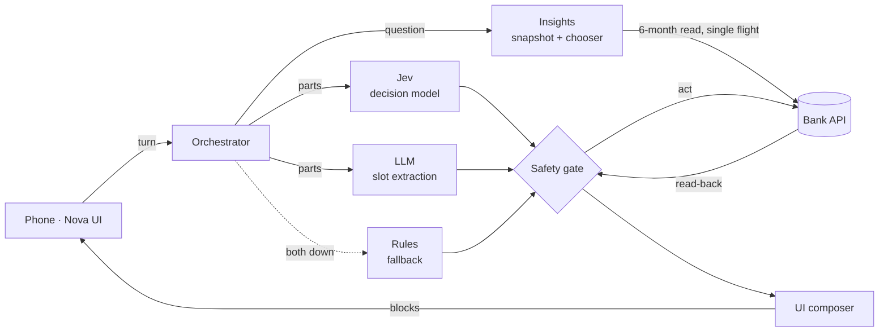
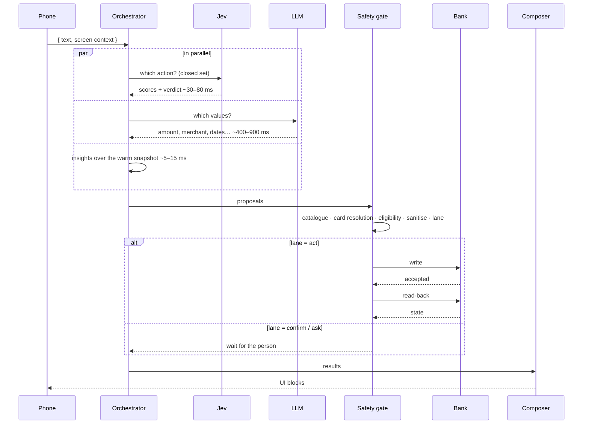
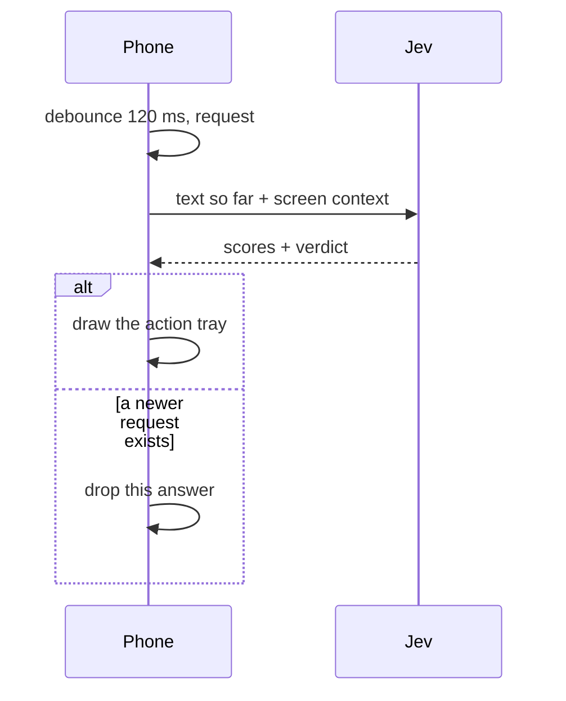
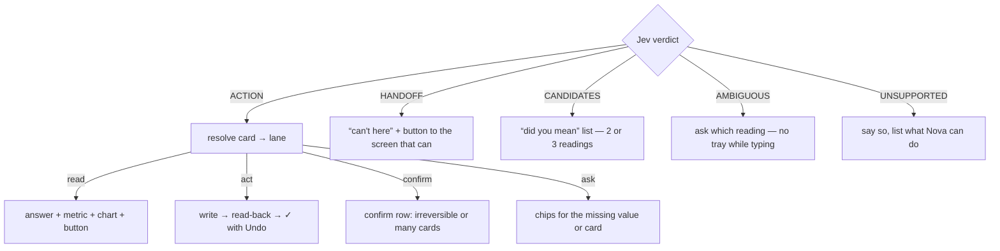

# Awesome UI on Fly — Architecture

Nova splits one hard problem — *understand a sentence and change a bank card safely* — into small parts that are each good at one thing.

| Part | Job | Why it's separate |
|---|---|---|
| **Jev** (decision model) | Picks **which** action, from a closed catalogue, with a score per choice | A closed set can't invent an action. Scores make thresholds possible. Fast enough to run on every keystroke |
| **LLM** | Pulls **open values** out of the sentence: amounts, merchants, countries, periods | Good at language, bad at being a gate. It never picks the action |
| **Rules decider** | Answers when both models are down | Slower and blunter, but the conversation never dies |
| **Safety gate** | Deterministic checks between any model output and the bank | The only door to a write. No model output passes around it |
| **Bank API** | Write, then **read back** | A ✓ is shown only when the read-back confirms the write |
| **Insights** | Reads a spending question into closed lists, picks a chart from the data's shape, builds the panel | Pure and fast (< 15 ms) over a warm in-memory snapshot |
| **UI composer** | Turns results into UI blocks | The phone draws primitives; it knows nothing about banking |

## System view

## A turn (press send)

## A keystroke (score as you type)

Only Jev answers keystrokes. The LLM and rules never do: if Jev is unavailable the tray is **absent**, not slow or blunt. The tray never writes anything. A tap on it builds an ordinary turn (your words plus the card you picked) and sends it down the same path as pressing send, so there is exactly one route to a bank write.

## From verdict to UI

The composer picks the view from the question. Ask about a category and you get weekly bars. Ask where the money went and you get bars by category. A week with no spending is drawn without a `$0` label.

## Lanes

| Lane | When |
|---|---|
| **act** | reversible, confident, card known, all values present |
| **confirm** | irreversible (report lost, dispute, activate) **or** acting on all cards at once |
| **ask** | a value is missing, or the card isn't known |
| **read** | a question, not a change |

## Card resolution: cheapest correct signal first

1. The card the person **picked**
2. A card **named** in the message (“my travel card”, “4821”)
3. The **transaction** being discussed (disputes)
4. The card **on screen**
5. A card named **earlier in the same message**
6. The **only** card the person has
7. Otherwise, **ask**, showing every usable card

Scores may order the picker. They never remove a card from it.

## Thresholds

| Name | Value | Meaning |
|---|---|---|
| act | 0.60 | the lowest score an action needs to be asserted |
| high-stakes | 0.70 | the bar for report lost/stolen and disputes |
| handoff | 0.50 | a named screen for an out-of-scope request |
| candidate floor | 0.35 | the lowest score that still counts as a plausible reading |
| margin | 0.15 | how far the winner must lead any plausible rival |
