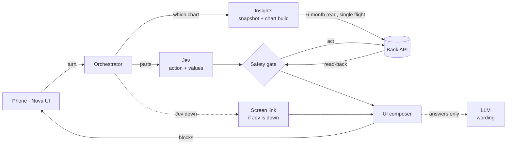
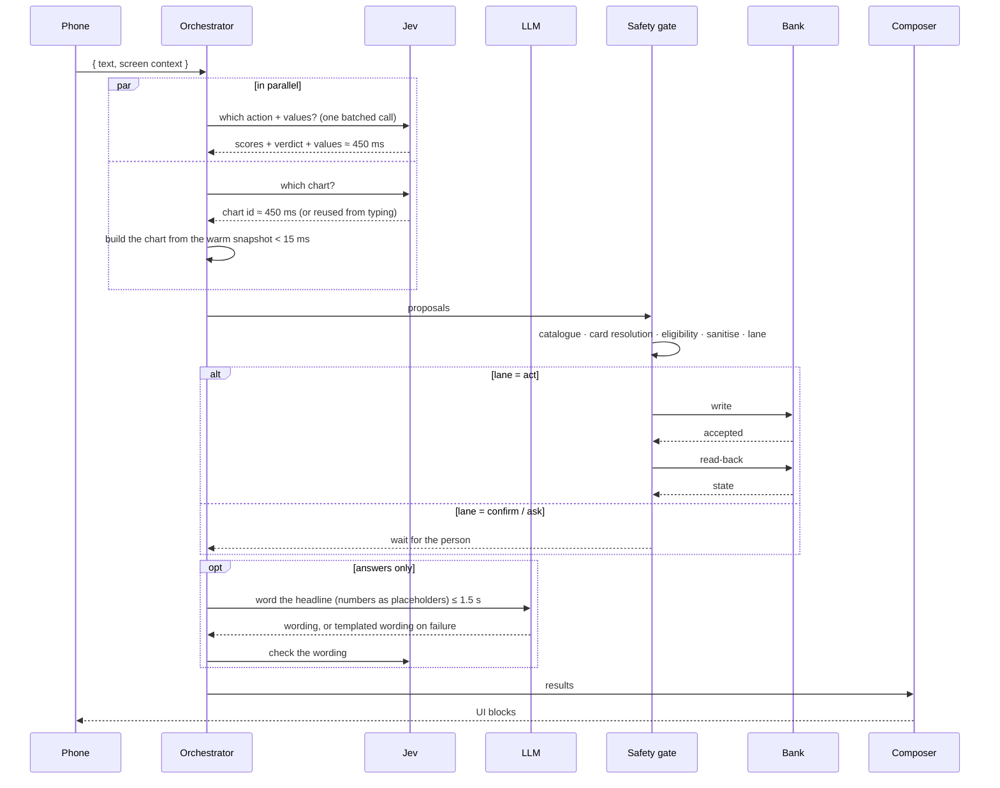
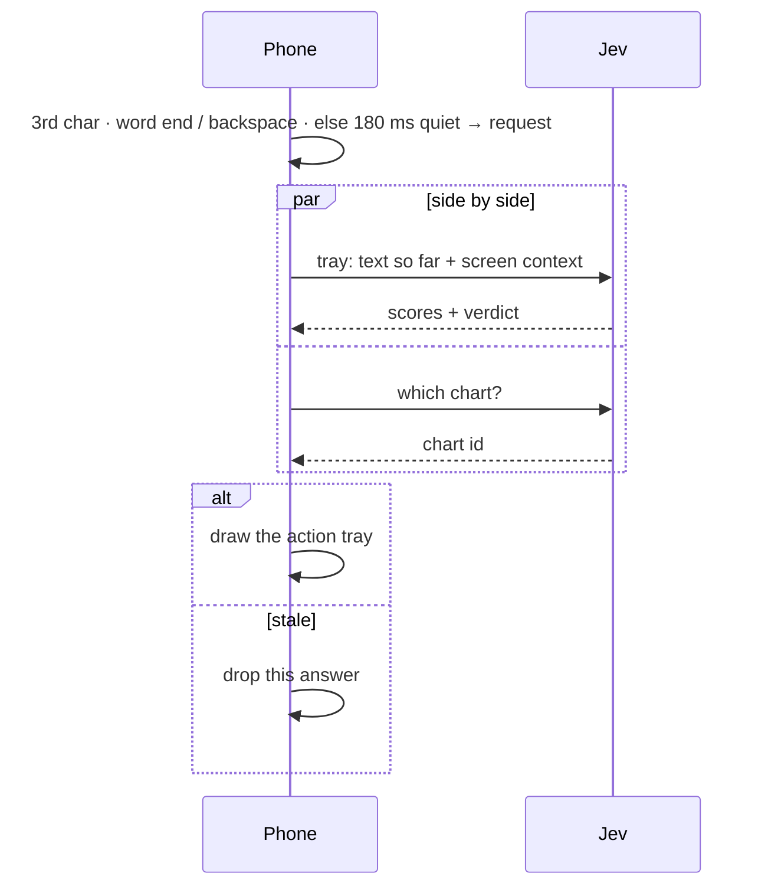
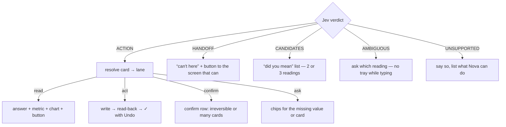

# Awesome UI on Fly — Architecture

Nova splits one hard problem — *understand a sentence and change a bank card safely* — into small parts that are each good at one thing.

| Part | Job | Why it's separate |
|---|---|---|
| **Jev** (decision model) | Decides **everything**: the action from a closed catalogue, with a score per choice, **and** its values (amount, merchant, dates, card), in one batched call per turn | A closed set can't invent an action. Scores make thresholds possible. Fast enough to run on every keystroke |
| **LLM** | Writes **words only**: an answer's headline, follow-up wording, advice wording | Good at language, bad at being a gate. Never decides, never extracts values, never on keystrokes or bank writes |
| **Screen link** | When Jev is down: “I can't understand requests right now” + a button to the screen that can do it | No second decider. Says so instead of guessing |
| **Safety gate** | Deterministic checks between any model output and the bank | The only door to a write. No model output passes around it |
| **Bank API** | Write, then **read back** | A ✓ is shown only when the read-back confirms the write |
| **Insights** | Jev reads which chart the question asks for; deterministic code builds the panel | < 15 ms over a warm in-memory 6-month snapshot |
| **UI composer** | Turns results into UI blocks | The phone draws primitives; it knows nothing about banking |

## System view

## A turn (press send)

- One batched Jev call per turn (~44 questions answered in parallel server-side)
- Jev warm: p50 ≈ 450 ms · p95 ≈ 0.6–1.1 s · first call of a session ≈ 0.7 s (pre-warmed when the sheet opens)
- Turn budget 7.0 s = first attempt 5.0 s + one retry after 0.25 s · chart call 4.0 s
- Headline wait capped at 1.5 s (typical 0.6–0.9 s) · on failure → templated wording
- Bank write → read-back → ✓ · bank timings are simulated
- A sent turn is typically ~1.5–3.5 s end to end
- Jev down → “I can't understand requests right now” + a button to the screen that can

## A keystroke (score as you type)

- Only Jev answers keystrokes: one tray call + one chart call, side by side · the LLM never does
- First call at the 3rd character (no wait) · again at once at each word end or backspace · otherwise after 180 ms of quiet inside a word
- ≤ 3 tray calls in flight (2 for charts) · tray budget 2.5 s, no retry
- An answer is used only if its text is still in the box and it's newer than the last one shown
- The tray lands ≈ 0.6 s after the 3rd character
- Jev down → no tray: **absent**, not slow or blunt
- The tray never writes. A tap builds an ordinary turn (your words + the card you picked) down the same path as send: one route to a bank write

## From verdict to UI

- Jev reads which chart the question asks for; deterministic code builds it from the snapshot in < 15 ms
- Snapshot: fresh 120 s · stale-served ≤ 30 min while one refresh runs · single-flight · cold load ≈ 65 ms · warmed when the sheet opens
- A week with no spending is drawn without a `$0` label

## Lanes

| Lane | When |
|---|---|
| **act** | reversible, confident, card known, all values present |
| **confirm** | irreversible (report lost, dispute, activate) **or** acting on all cards at once |
| **ask** | a value is missing, or the card isn't known |
| **read** | a question, not a change |

## Card resolution: cheapest correct signal first

1. The card the person **picked**
2. A card **named** in the message (“my travel card”, “4821”)
3. The **transaction** being discussed (disputes)
4. The card **on screen**
5. A card named **earlier in the same message**
6. The **only** card the person has
7. Otherwise, **ask**, showing every usable card

Scores may order the picker. They never remove a card from it.

## Thresholds

| Name | Value | Meaning |
|---|---|---|
| act | 0.50 | an action's `act_*` Noul must reach this to pass |
| high-stakes | 0.70 | report lost/stolen and disputes (or `route` agreeing at 0.80) |
| handoff | 0.50 | `handoff_screen` names a screen for an out-of-scope request |
| candidate floor | 0.25 | a reading this likely is offered in "did you mean" (2–3 shown) |
| tie margin | 0.10 | readings closer than this are a tie; `route` breaks it |
| route veto | 0.70 | `route` = NONE this sure vetoes any action |
| lane · act / ask | 0.85 / 0.60 | the safety gate acts at 0.85 (unfreeze 0.90), else confirms or asks |
